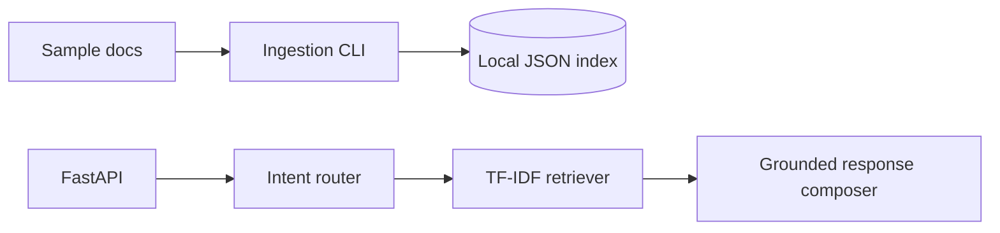

# Enterprise AI Copilot Platform

Portfolio-safe implementation of the **Enterprise AI Copilot Platform** described on my resume. Uses only free/open-source local components and synthetic sample documents — no employer data, keys, or paid APIs.

## What it demonstrates
- FastAPI microservice for knowledge-base ingestion and question answering
- Retrieval-Augmented Generation (RAG) over local documents
- Lightweight agent graph with intent routing (`qa`, `summarize`, `search`)
- Local vector search via scikit-learn TF-IDF cosine similarity (FAISS/Hugging Face can be plugged in later)
- Evaluation helpers, Dockerfile, GitHub Actions CI, pytest tests

## Quick start
```bash
python3 -m venv .venv
. .venv/bin/activate
pip install -r requirements.txt
python -m app.ingest --input sample_docs --store data/index.json
uvicorn app.main:app --reload
```
Open `http://127.0.0.1:8000/docs`.

## Example
```bash
curl -X POST http://127.0.0.1:8000/query -H 'Content-Type: application/json' -d '{"question":"How does the copilot reduce hallucinations?","top_k":3}'
```

## Architecture


## Privacy note
Clean-room portfolio demo. It does not connect to JPMorgan Chase, Zensar, Vertex AI, OpenAI, or any enterprise system.
